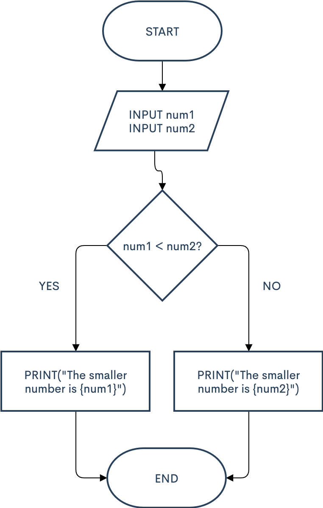
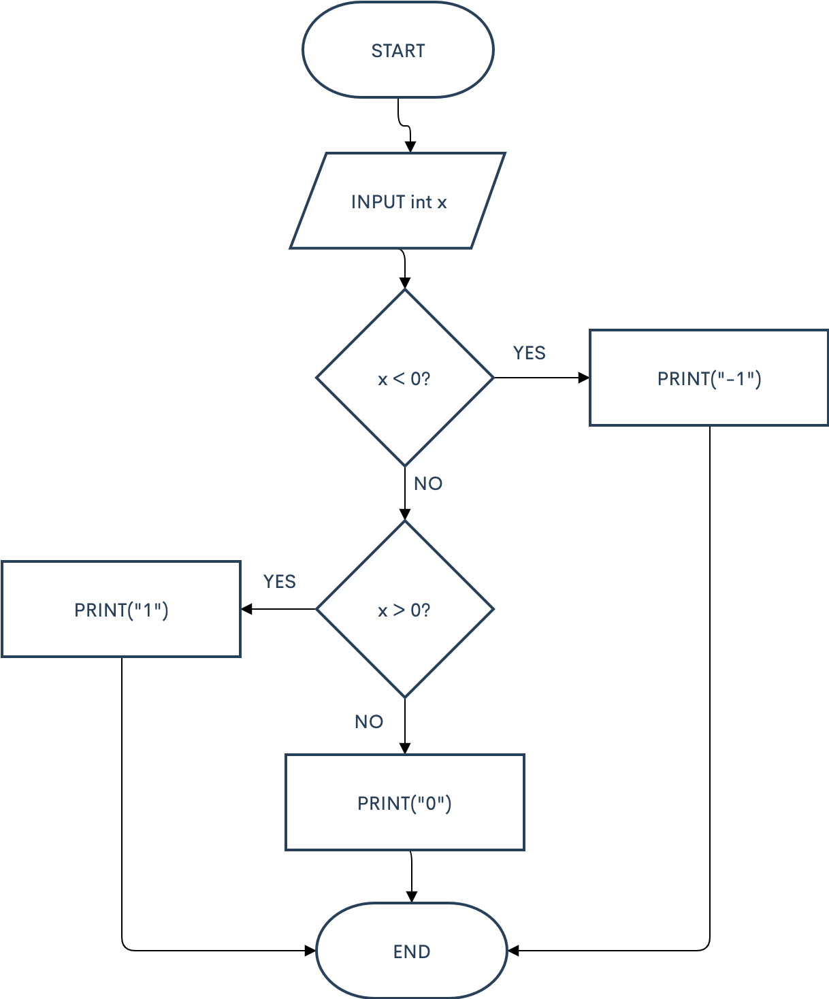
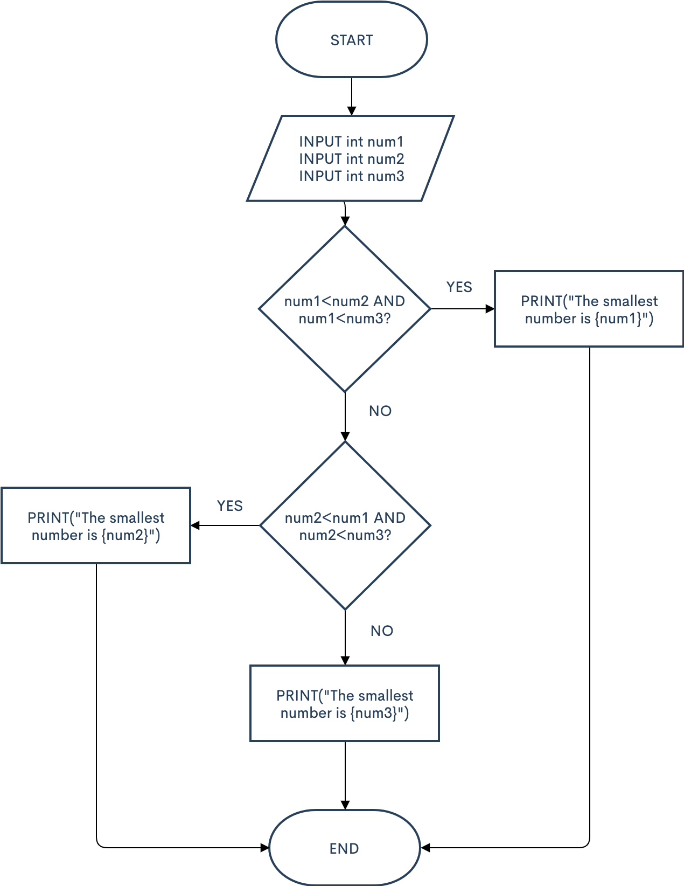
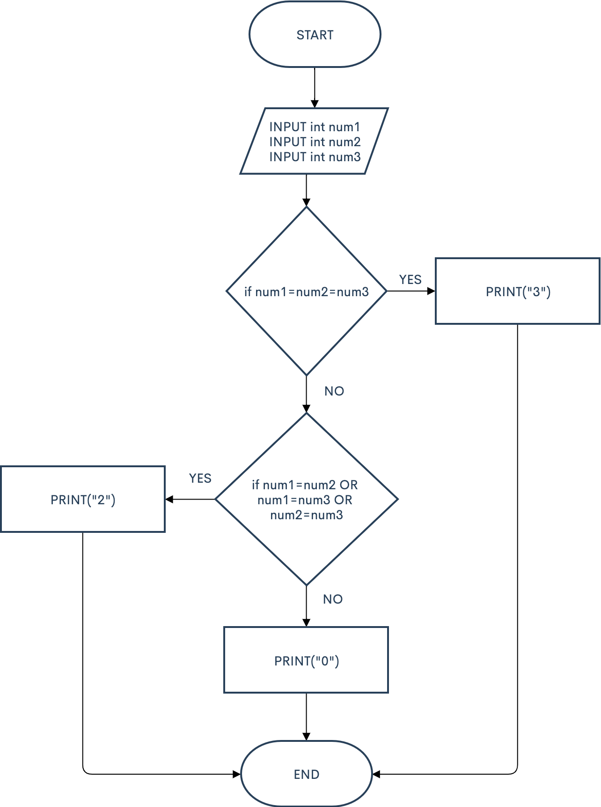
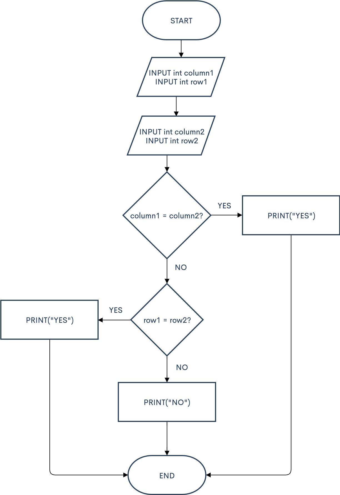
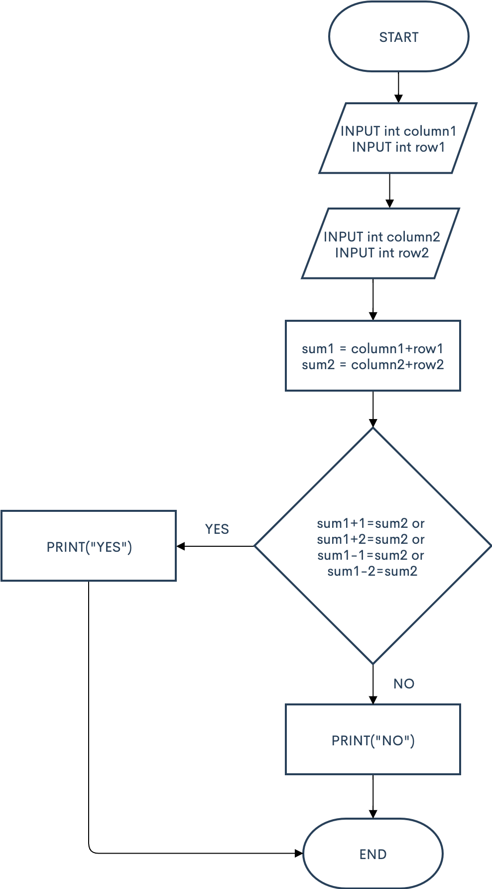
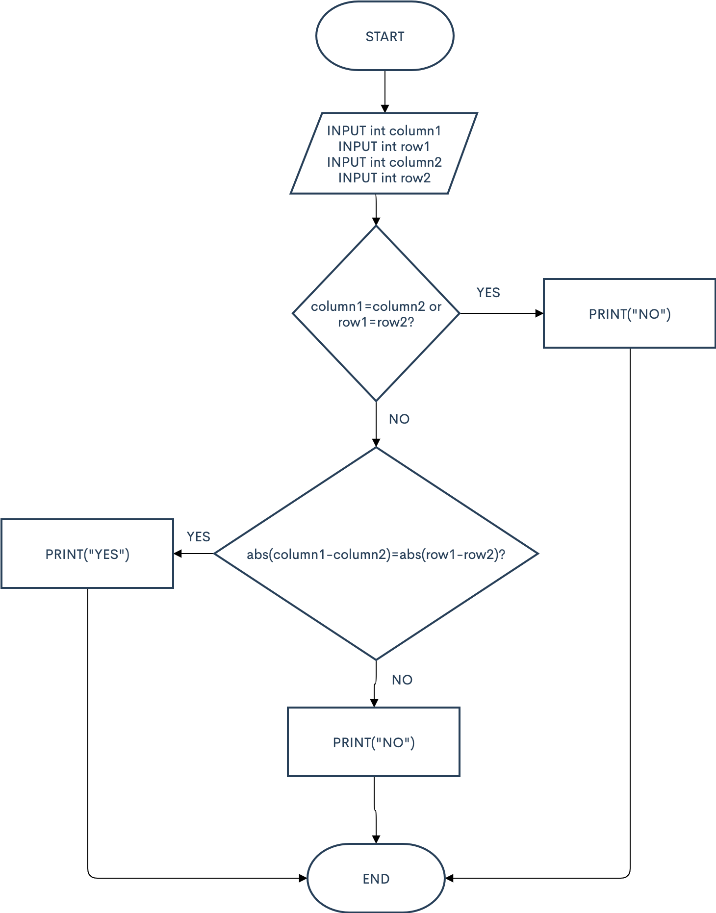
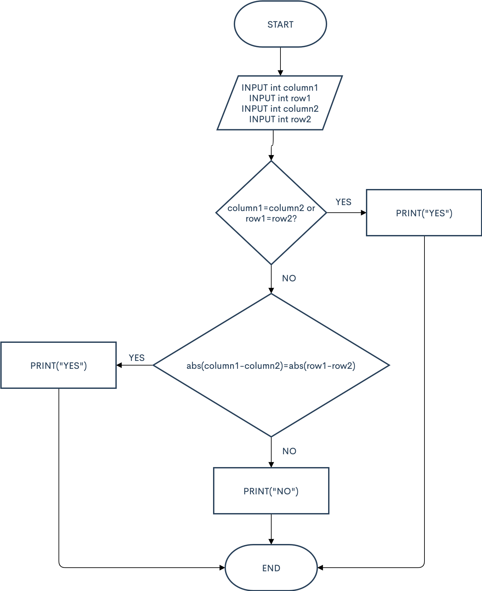
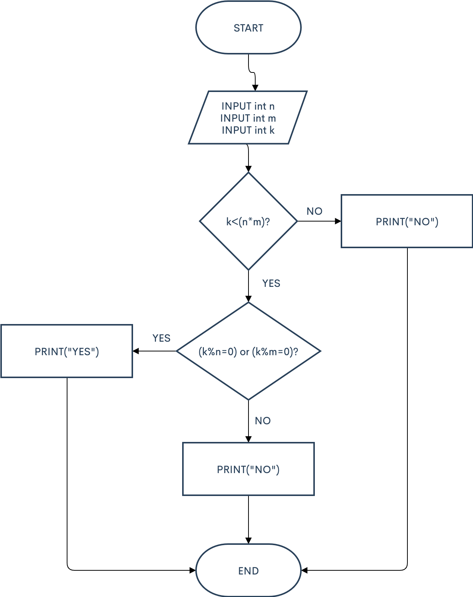
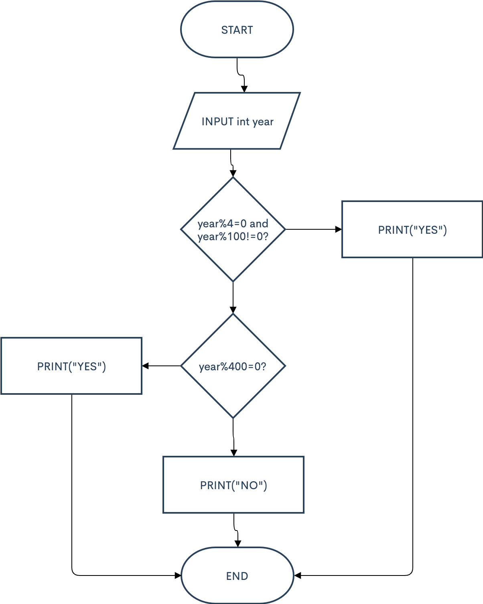

Given two integers, print the smaller value.

num1 = int(input("Please enter a number: "))

num2 = int(input("Please enter a number: "))

if num1 < num2:

  print(f"The smaller number is {num1}")
  
else:

  print(f"The smaller number is {num2}")

For the given integer X print 1 if it's positive, -1 if it's negative, or 0 if it's equal to zero. Try to use the cascade if-elif-else for it.

x = int(input("Please enter a number: "))

if x < 0 :

  print("-1")
  
elif x > 0 :

  print("1")
  
else:

  print("0")
  
  
  

Given three integers, print the smallest value.

num1 = int(input("Please enter a number: "))

num2 = int(input("Please enter a number: "))

num3 = int(input("Please enter a number: "))

if num1<num2 and num1<num3:

  print(f"The smallest number is {num1}")
  
elif num2<num1 and num2<num3:

  print(f"The smallest number is {num2}")
  
else:

  print(f"The smallest number is {num3}")
  
  

Given three integers, determine how many of them are equal to each other. The program must print one of these numbers: 3 (if all are the same), 2 (if two of them are equal to each other and the third is different) or 0 (if all numbers are different).

num1 = int(input("Please enter a number: "))

num2 = int(input("Please enter a number: "))

num3 = int(input("Please enter a number: "))

if num1==num2==num3:

  print("3")
  
elif num1==num2 or num1==num3 or num3==num2:

  print("2")
  
else: 

  print("0")
  
  
  

Chess rook moves horizontally or vertically. Given two different cells of the chessboard, determine whether a rook can go from the first cell to the second in one move. The program receives the input of four numbers from 1 to 8, each specifying the column and row number, first two - for the first cell, and then the last two - for the second cell. The program should output YES if a rook can go from the first cell to the second in one move, or NO otherwise.

column1 = int(input("Please enter column of current cell: "))

row1 = int(input("Please enter row of current cell: "))

column2 = int(input("Please enter column of second cell: "))

row2 = int(input("Please enter row of second cell: "))

if column1 == column2:

  print("YES")
  
elif row1 == row2:

  print("YES")
  
else:

  print("NO")

Given two cells of a chessboard. If they are painted in one color, print the word YES, and if in a different color - NO. The program receives the input of four numbers from 1 to 8, each specifying the column and row number, first two - for the first cell, and then the last two - for the second cell.

column1 = int(input("Please enter column of first cell: "))

row1 = int(input("Please enter row of first cell: "))

column2 = int(input("Please enter column of second cell: "))

row2 = int(input("Please enter row of second cell: "))

sum = int((column1+column2+row1+row2))

if sum%2==0:

  print("YES")
  
else:

  print("NO")
  
  
  

Chess king moves horizontally, vertically or diagonally to any adjacent cell. Given two different cells of the chessboard, determine whether a king can go from the first cell to the second in one move. The program receives the input of four numbers from 1 to 8, each specifying the column and row number, first two - for the first cell, and then the last two - for the second cell. The program should output YES if a king can go from the first cell to the second in one move, or NO otherwise.

column1 = int(input("Please enter column of current cell: "))

row1 = int(input("Please enter row of current cell: "))

column2 = int(input("Please enter column of second cell: "))

row2 = int(input("Please enter row of second cell: "))

sum1 = column1+row1

sum2 = column2+row2

if sum1+1==sum2 or sum1+2==sum2 or sum1-1==sum2 or sum1-2==sum2:

  print("YES")
  
else:

  print("NO")
  
  
  

In chess, the bishop moves diagonally, any number of squares. Given two different squares of the chessboard, determine whether a bishop can go from the first to the second in one move. The program receives as input four numbers from 1 to 8, specifying the column and row numbers of the starting square and the column and row numbers of the ending square. The program should output YES if a Bishop can go from the first square to the second in one move, or NO otherwise.

column1 = int(input("Please enter column of current cell: "))

row1 = int(input("Please enter row of current cell: "))

column2 = int(input("Please enter column of second cell: "))

row2 = int(input("Please enter row of second cell: "))

if column1==column2 or row1==row2:    

  print("NO")
  
elif abs(column1-column2)==abs(row1-row2):

  print("YES")
  
else:

  print("NO")
 
  
  
  
 
Chess queen moves horizontally, vertically or diagonally to any number of cells. Given two different cells of the chessboard, determine whether a queen can go from the first cell to the second in one move. The program receives the input of four numbers from 1 to 8, each specifying the column and row number, first two - for the first cell, and then the last two - for the second cell. The program should output YES if a queen can go from the first cell to the second in one move, or NO otherwise.

column1 = int(input("Please enter column of current cell: "))

row1 = int(input("Please enter row of current cell: "))

column2 = int(input("Please enter column of second cell: "))

row2 = int(input("Please enter row of second cell: "))

if column1==column2 or row1==row2:  

  print("YES")
  
elif abs(column1-column2)==abs(row1-row2):

  print("YES")
  
else:

  print("NO")
  
  
  

Chocolate bar has the form of a rectangle divided into n×m portions. Chocolate bar can be split into two rectangular parts by breaking it along a selected straight line on its pattern. Determine whether it is possible to split it so that one of the parts will have exactly k squares. The program reads three integers: n, m, and k. It should print YES or NO.

n = int(input("Please enter the length (in squares) of the chocolate: "))

m = int(input("Please enter the width (in squares) of the chocolate : "))

k = int(input("Please enter how many squares much be in one part: "))

if k<(n*m):

  if (k%n==0) or (k%m==0):
  
    print("YES")
    
  else:
  
    print("NO")
    
else:

  print("NO")
  

Given the year number. You need to check if this year is a leap year. If it is, print LEAP, otherwise print COMMON. The rules in Gregorian calendar are as follows:

a year is a leap year if its number is exactly divisible by 4 and is not exactly divisible by 100 a year is always a leap year if its number is exactly divisible by 400 Warning. The words LEAP and COMMON should be printed all caps.

year = int(input("Please enter the year: "))

if year%4==0 and year%100!=0:

  print("LEAP")
  
elif year%400==0:

  print("LEAP")
  
else:

  print("COMMON")
  
  
